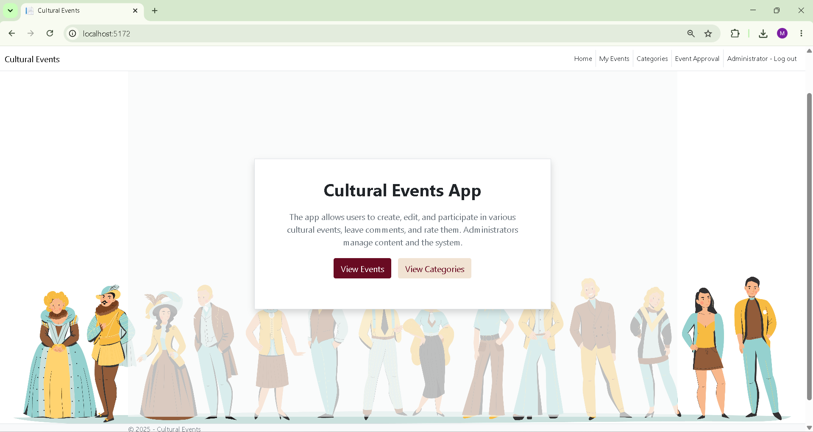

# Cultural Events Platform

A full-stack ASP.NET Core MVC application for discovering, creating, approving, joining, commenting on, and rating cultural events. The project solves the common coordination problem around local cultural programming by giving users a structured event hub while giving administrators moderation tools for categories and event approvals.



## Tech Stack

- **Language:** C#
- **Framework:** ASP.NET Core MVC 8.0
- **Authentication:** ASP.NET Core Identity with role-based authorization
- **Database:** SQL Server with Entity Framework Core
- **ORM / Data Access:** Entity Framework Core 8
- **Frontend:** Razor Views, HTML, CSS, Bootstrap, JavaScript
- **API Integration:** OpenWeather API via `HttpClient`
- **Tooling:** .NET SDK 8, EF Core Tools, Visual Studio / VS Code

## Key Features

- **User authentication and authorization** with ASP.NET Core Identity.
- **Role-based access control** for regular users and administrators.
- **Admin moderation workflow** for approving event categories and pending events.
- **Event management** with create, edit, delete, public listing, filtering, and detail views.
- **User registrations** for events, including duplicate-registration protection.
- **Comments and ratings** for event engagement and feedback.
- **Average rating calculation** stored and displayed per event.
- **Weather integration** that shows current weather details for an event location.
- **Database constraints** for unique category names, one registration per user per event, and one rating per user per event.
- **Seeded admin/user roles** on application startup for smoother local development.

## Getting Started / How to Run Locally

### Prerequisites

Install the following before running the project:

- [.NET 8 SDK](https://dotnet.microsoft.com/download)
- SQL Server or SQL Server LocalDB
- Git

### 1. Clone the Repository

```bash
git clone <your-repository-url>
cd WebAplikacija-KulturniDogadjaji
```

### 2. Restore Dependencies

```bash
dotnet restore ProjekatWebKulturniDogadjaji.sln
```

### 3. Configure Local Secrets

This project expects a SQL Server connection string named `DefaultConnection` and optional weather API settings. Do not commit real secrets to source control.

Using .NET user secrets:

```bash
cd ProjekatWebKulturniDogadjaji
dotnet user-secrets set "ConnectionStrings:DefaultConnection" "<your-sql-server-connection-string>"
dotnet user-secrets set "WeatherSettings:ApiKey" "<your-openweather-api-key>"
dotnet user-secrets set "WeatherSettings:BaseUrl" "https://api.openweathermap.org/data/2.5/weather"
```

Example local SQL Server connection string:

```bash
dotnet user-secrets set "ConnectionStrings:DefaultConnection" "Server=(localdb)\\mssqllocaldb;Database=CulturalEventsDb;Trusted_Connection=True;MultipleActiveResultSets=true"
```

### 4. Apply Database Migrations

```bash
dotnet ef database update
```

If the EF CLI is not installed, install it first:

```bash
dotnet tool install --global dotnet-ef
```

### 5. Run the Application

```bash
dotnet run
```

The app will start using the URLs from `Properties/launchSettings.json`, typically:

```text
https://localhost:7133
http://localhost:5172
```

### 6. Development Notes

- The application seeds the `Admin` and `User` roles on startup.
- A development admin account is created/reset in `Program.cs`; update those credentials before any real deployment.
- Keep API keys and production connection strings in user secrets, environment variables, or a secure deployment secret store.

## Project Structure

```text
ProjekatWebKulturniDogadjaji/
|-- Areas/Identity/          # Login and registration pages
|-- Controllers/             # MVC controllers for events, categories, ratings, comments, registrations
|-- Data/                    # EF Core DbContext and migrations
|-- Models/                  # Domain models and Identity user model
|-- Services/                # External service integrations
|-- Views/                   # Razor UI pages
|-- wwwroot/                 # Static assets, CSS, JavaScript, images
`-- Program.cs               # Application startup, services, routing, role/admin seeding
```

## Recruiter-Friendly Summary

This project demonstrates practical full-stack ASP.NET Core development: authentication, authorization, relational data modeling, external API integration, MVC architecture, form workflows, validation, and admin moderation. It is built around real product concerns such as role separation, duplicate action prevention, user-generated content, and maintainable server-rendered UI.
